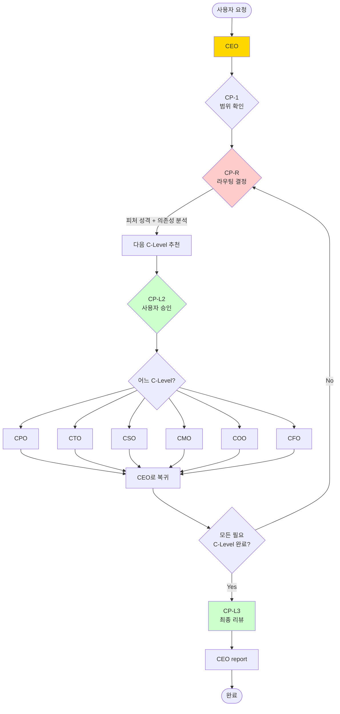
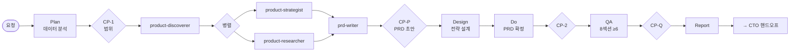
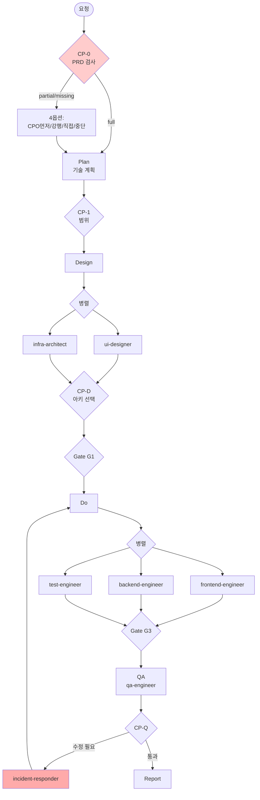
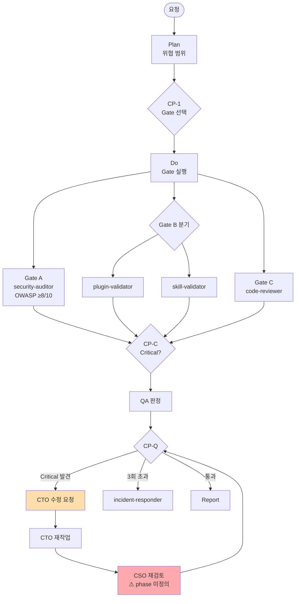
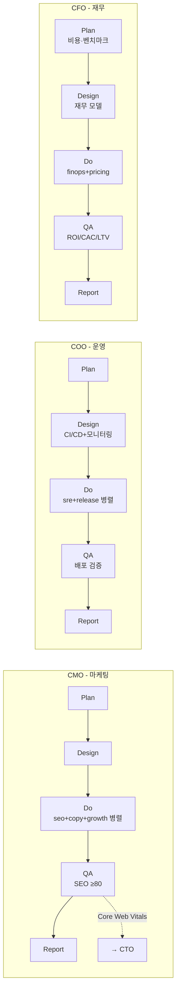

# VAIS Code C-Suite 아키텍처 플로우 감사 보고서

> **작성일**: 2026-04-09
> **대상 버전**: v0.49.2
> **범위**: 7개 C-Level(CEO/CPO/CTO/CSO/CMO/COO/CFO)의 업무 플로우 및 상호 연결 구조

## 1. 최상위 오케스트레이션 (CEO 동적 라우팅)

**의존성 규칙** (`vais.config.json > cSuite.launchPipeline.dependencies`):
- `CSO / COO / CFO → CTO`
- `CMO → CPO`

---

## 2. 각 C-Level 내부 PDCA 플로우

### 2.1 CPO (제품 기획)

**특성**:
- Sub-agent 순차 호출: `product-discoverer → (product-strategist + product-researcher 병렬) → prd-writer`
- PRD 8개 섹션 완성도 검증 (최소 6개)
- CTO 핸드오프 전 반드시 AskUserQuestion

### 2.2 CTO (기술 구현) — 가장 정교함

**특성**:
- CP-0에서 PRD 의무 검사 (`vais.config.json > gates.cto.plan.requirePrd`: ask/strict/skip)
- mandatory phase 순차 실행: plan → design → do → qa
- Design 불완전 시 다음 phase 진입 금지
- QA에서 incident-responder 자동 호출 조건 4가지
- CSO↔CTO 반복 루프: 최대 3회 반복

### 2.3 CSO (보안·품질) — CTO와 루프

**특성**:
- 3가지 Gate: A(OWASP 검사, 8/10 이상 통과), B(플러그인 마켓플레이스 배포 검증), C(독립 코드 리뷰)
- Gate B 서브 분기: plugin-validator(전체) vs skill-validator(개별 skill)
- Critical 차단 옵션: CP-C에서 사용자 판정
- CTO↔CSO 반복: Critical 미해결 시 incident-responder 호출

### 2.4 CMO / COO / CFO (표준 PDCA)

**CMO 특성**:
- SEO 점수 기준 80점 (Title/Meta 20 + Semantic HTML 20 + Core Web Vitals 25 + 구조화 데이터 20 + 기타 15)
- CP-S에서 SEO 전략 확인 필수
- CTO 핸드오프: Core Web Vitals 개선 필요 시

**COO 특성**:
- CI/CD 단계 5가지 필수: Lint → Test → Build → Security → Deploy
- 모니터링 기준: 에러율 >1%(Critical), 응답시간 p99 >3s(Warning), 가용성 <99.9%(Critical)
- Rollback 절차 필수 포함

**CFO 특성**:
- 비용/수익/ROI 3개 수치 모두 필수
- ROI = (순이익 / 총 투자 비용) × 100
- Unit Economics: CAC, LTV, Payback, NRR 필수 계산
- 불확실 수치는 범위로 표시 (낙관/기본/비관 시나리오)

---

## 3. C-Level별 플로우 요약 표

| C-Level | 진입점 | Mandatory Phase | 주요 Sub-Agent | Gate/Checkpoint | 산출물 경로 | 연결 C-Level |
|---|---|---|---|---|---|---|
| **CEO** | 서비스 런칭, 동적 라우팅 | plan → (design 선택) → do → qa → report | absorb-analyzer, retrospective-writer | CP-1, CP-R, CP-A, CP-2, CP-L2, CP-L3 | `docs/{n}/ceo_{feature}.{phase}.md` | 전체 6개 C-Level |
| **CPO** | 제품 기획, PRD | plan → design → do → qa | product-discoverer, product-strategist, product-researcher, prd-writer, ux-researcher, data-analyst | CP-1, CP-P, CP-2, CP-Q | `docs/{n}/cpo_{feature}.{phase}.md` | → CTO, CMO |
| **CTO** | 기술 구현 | plan(CP-0) → design → do → qa | infra-architect, ui-designer, frontend/backend/test-engineer, qa-engineer, incident-responder | CP-0, CP-1, CP-D, CP-G1~G4, CP-2, CP-Q | `docs/{n}/cto_{feature}.{phase}.md` | ← CPO, ↔ CSO, → COO/CFO |
| **CSO** | 보안·품질 | plan → (design 선택) → do → qa | security-auditor, plugin-validator, code-reviewer, compliance-auditor, skill-validator | CP-1, CP-C, CP-2, CP-Q | `docs/{n}/cso_{feature}.{phase}.md` | ↔ CTO (루프) |
| **CMO** | 마케팅 전략 | plan → (design 선택) → do → qa | seo-analyst, copy-writer, growth-analyst | CP-1, CP-S, CP-2, CP-Q | `docs/{n}/cmo_{feature}.{phase}.md` | ← CPO, → CTO |
| **COO** | 배포·운영 | plan → (design 선택) → do → qa | release-engineer, sre-engineer, release-monitor, performance-engineer, technical-writer | CP-1, CP-2, CP-Q | `docs/{n}/coo_{feature}.{phase}.md` | ← CTO, ← CSO |
| **CFO** | 재무·가격 | plan → (design 선택) → do → qa | finops-analyst, pricing-analyst | CP-1, CP-2, CP-Q | `docs/{n}/cfo_{feature}.{phase}.md` | ← CEO, ← CPO, ← CTO |

---

## 4. 발견된 Gap (우선순위별)

### 🔴 Critical (4건) — 구조적 결함

| # | Gap | 영향 | 해결 방향 |
|---|---|---|---|
| **C-1** | CTO만 `CP-0 PRD 검사` 존재. CPO/CMO/COO/CFO는 선행 산출물 검사 없음 | 나쁜 입력 → 재작업 폭증 | 각 C-Level에 선행 검사 게이트 추가 (CFO→CTO/CPO, CMO→CPO, COO→CTO) |
| **C-2** | CSO↔CTO 반복 루프에서 **CSO 재검토 phase가 미정의** (design/qa 어느 것?) | 루프 종료 조건 불명확 | CSO에 `verification-loop` phase 또는 qa 재진입 규칙 명시 |
| **C-3** | `launchPipeline.dependencies`에 `CMO→CPO` 있으나 CLAUDE.md는 "hard constraint 아님"으로 완화 | CPO 미완료 상태로 CMO 진행 가능 | CMO plan에 `CP-0`(PRD 검사) 추가 또는 strict 강제 |
| **C-4** | QA→이전 phase **리턴 경로 미명시**. "모두 수정" 선택 시 do? design? plan? 어디로? | 수정 루프가 암묵적으로 작동 | 각 `CP-Q`에 "수정 시 복귀 phase" 명시 규칙 |

### 🟠 High (4건) — 완결성 결함

| # | Gap | 해결 방향 |
|---|---|---|
| **H-1** | `vais.config.json > autoKeywords`에 **cto/cpo/cfo 누락** (ceo/cso/cmo/coo만 존재) | `architecture/PRD/cost` 등 키워드 추가 |
| **H-2** | CEO `design phase`가 선택(optional) → 위임 구조 설계 주체 불분명 | mandatory 전환 또는 plan에 위임 설계 포함 |
| **H-3** | CFO plan에서 CTO/CPO 산출물 자동 로드 없음 → 기술 스택 모른 채 비용 추정 | plan phase에 선행 문서 읽기 명시 |
| **H-4** | CMO→CTO 핸드오프는 CMO 측에만 있고 CTO가 **수신/처리 경로 없음** | CTO design/do에 외부 요청 수신 로직 추가 |

### 🟡 Medium (5건) — 운영 마찰

| # | Gap | 해결 방향 |
|---|---|---|
| **M-1** | CSO Gate B 분기(plugin vs skill validator)가 CP-2에서 결정 | CP-1로 앞당기기 또는 CP-B 신규 checkpoint 추가 |
| **M-2** | CTO incident-responder 자동 호출 조건(2회 반복 실패 등)이 agent가 직접 감지 | hooks/lib로 자동화 |
| **M-3** | CEO absorb mode의 `absorb-mcp` 분기 로직 테스트 커버리지 미확인 | vendor/{name}/ 배치 로직 테스트 추가 |
| **M-4** | 산출물 경로 규칙(`docs/{n}-{phase}/{role}_{feature}.{phase}.md`) **자동 검증기 부재** | git hook 또는 validator 추가 |
| **M-5** | "자동 실행" 규칙이 동일 C-Level 내부 vs C-Level 간 전환에서 상충 | 범위 명확화 (same vs cross C-Level) |

### 🟢 Low (3건) — 문서화

| # | Gap | 해결 방향 |
|---|---|---|
| **L-1** | CPO `product-strategist + product-researcher` 병렬 → prd-writer 수렴 순서 명시 부족 | 흐름 다이어그램 추가 |
| **L-2** | COO의 `release-monitor`/`performance-engineer` 호출 phase(design/do/qa) 불명확 | agent에 호출 phase 명시 |
| **L-3** | CFO 낙관/기본/비관 시나리오 작성 phase 미지정 | do/qa phase에 명시적 지침 추가 |

---

## 5. 핵심 요약

### 잘 구성된 부분

- 7개 C-Level 전체가 동일한 PDCA(`plan → design → do → qa → report`) 뼈대 준수
- Checkpoint + AskUserQuestion 강제 사용 일관
- 산출물 네이밍 규칙 통일 (`docs/{n}-{phase}/{role}_{feature}.{phase}.md`)
- CTO의 CP-0 / CP-D / CP-G1~G4 gate 시스템은 가장 성숙
- CEO 동적 라우팅 + 의존성 규칙 존재

### 구조적 결함의 공통 패턴

1. **CTO는 성숙, 다른 C-Level은 미성숙** — CTO에만 있는 선행 검사(CP-0), Gate 세분화(G1~G4), incident-responder 복구 루프가 나머지 6개 C-Level에는 부재
2. **루프 종료 조건이 암묵적** — CSO↔CTO, QA→이전 phase 등 역방향 흐름이 정의되어 있지만 "어느 phase로 돌아가는지"가 문서화 안 됨
3. **라우팅 커버리지 비대칭** — autoKeywords에 4/7개 C-Level만 있음 → CEO가 CTO/CPO/CFO를 완전 동적 라우팅 불가, 직접 추천에 의존

### 권장 다음 스텝

Critical 4건 중 **C-1(선행 검사)** 과 **C-4(QA 리턴 경로)** 가 가장 파급 효과가 큽니다. 이 둘을 먼저 해결하면 나머지 Critical/High 대부분이 자연스럽게 정리됩니다.

---

## 6. 참고 파일

- `agents/ceo/ceo.md`, `agents/cpo/cpo.md`, `agents/cto/cto.md`, `agents/cso/cso.md`, `agents/cmo/cmo.md`, `agents/coo/coo.md`, `agents/cfo/cfo.md`
- `vais.config.json` (workflow, orchestration, cSuite 섹션)
- `CLAUDE.md` (Agent Architecture 섹션)
- `skills/vais/SKILL.md`, `skills/vais/phases/`
