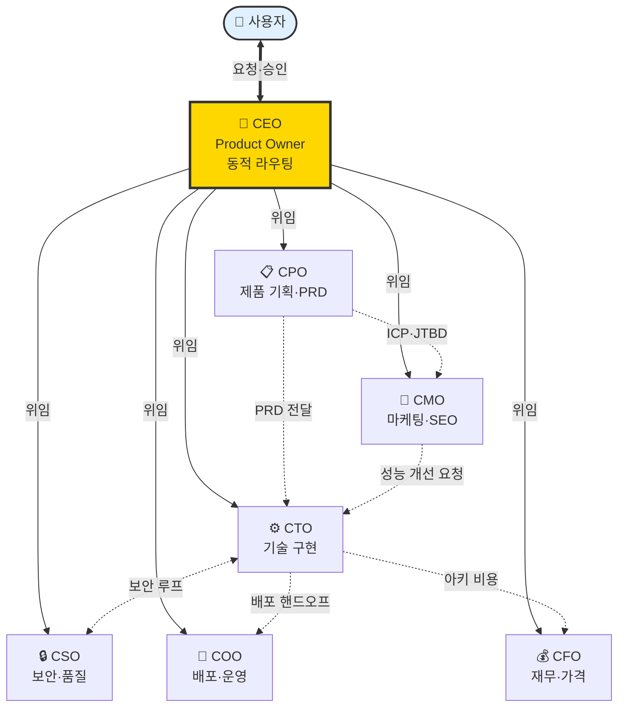
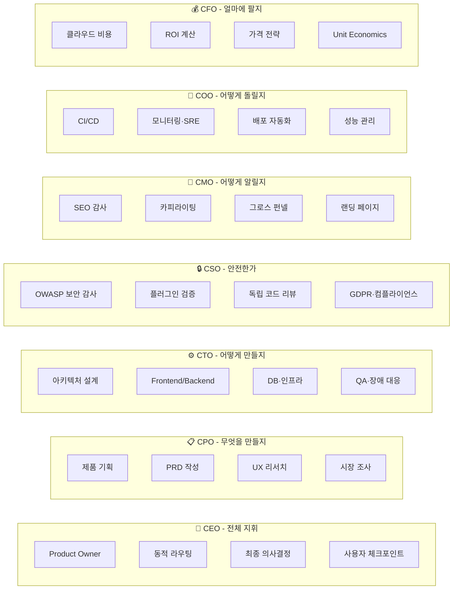
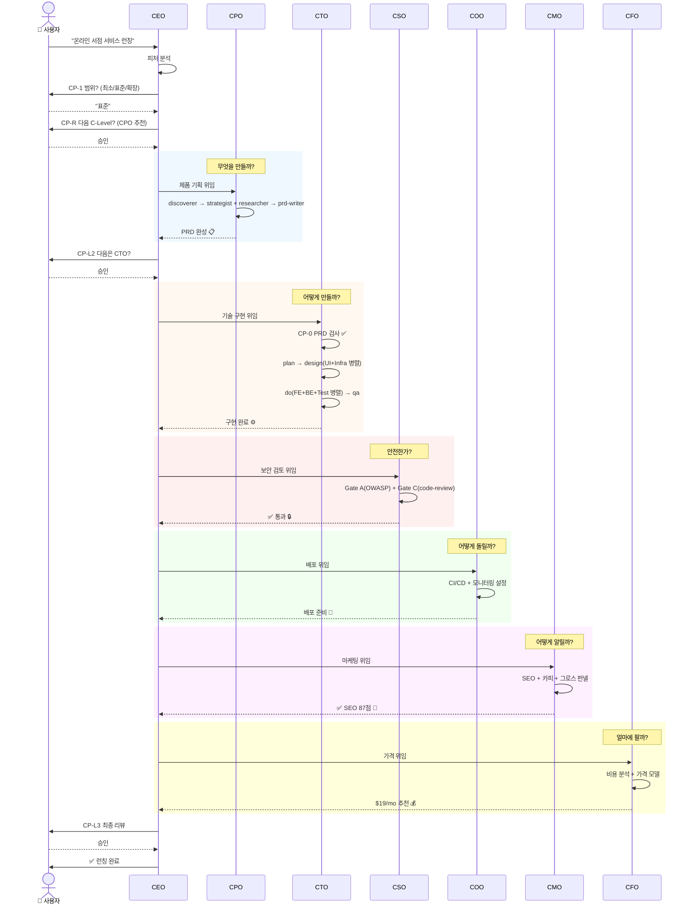
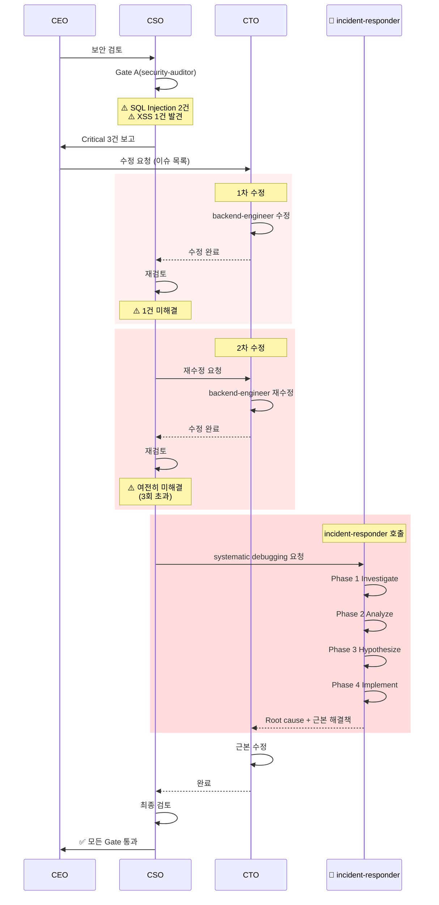
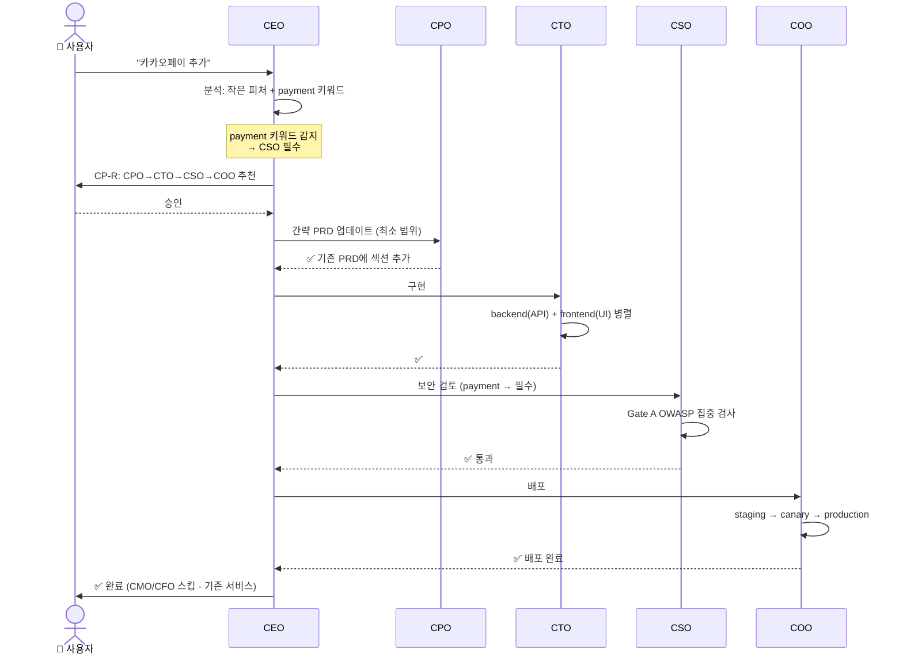
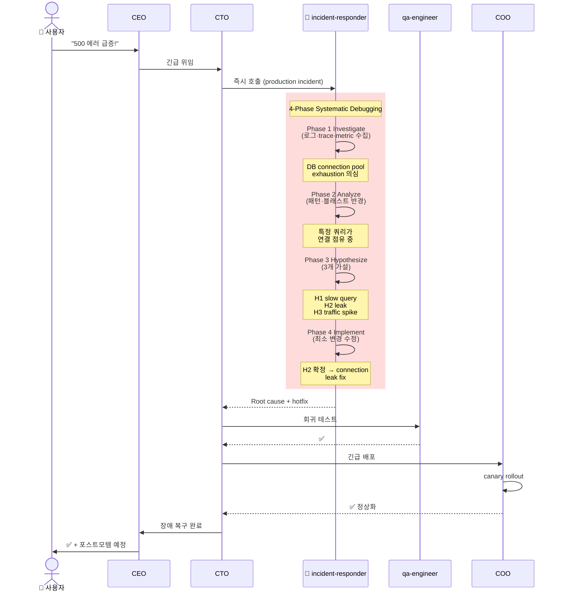
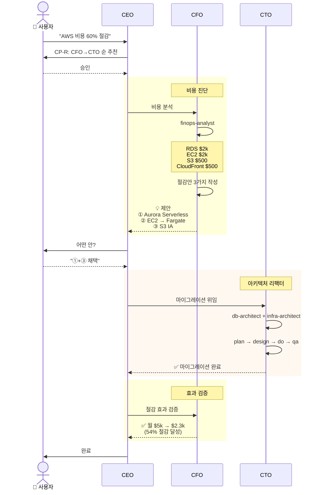
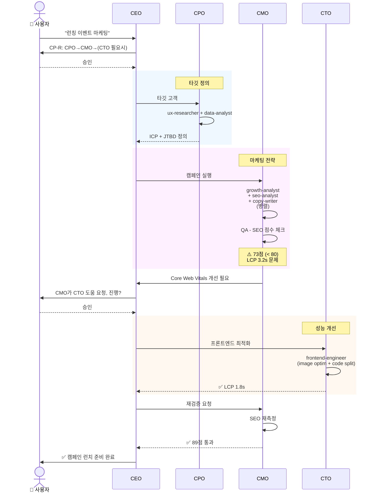
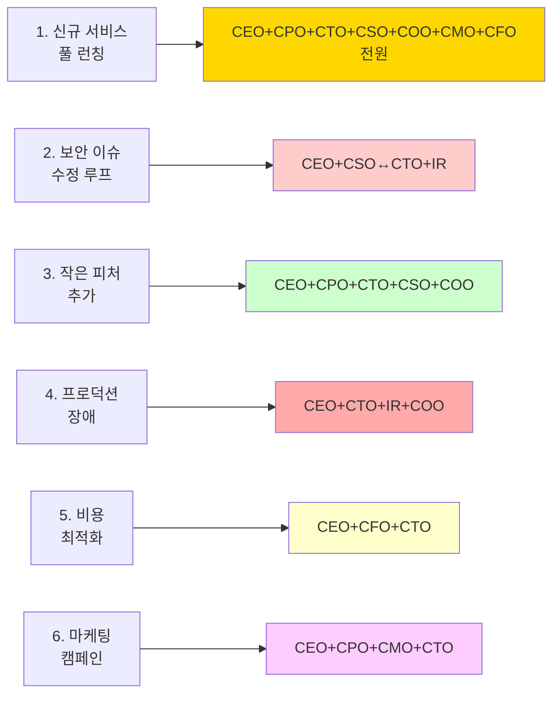

# VAIS Code C-Suite 관계·역할·시나리오 가이드

> **작성일**: 2026-04-09
> **대상 버전**: v0.49.2
> **목적**: 7개 C-Level의 관계·역할을 시각화하고, 상황별 시나리오로 협업 방식 이해

## 🗺️ Part 1. 관계 맵 (누가 누구와 협업하는가)

**읽는 법**
- **굵은 양방향 화살표 (`<==>`)**: 사용자↔CEO의 주요 대화 채널
- **실선 화살표 (`-->`)**: CEO의 공식 위임
- **점선 화살표 (`-.->`)**: C-Level 간 직접 협업/핸드오프

---

## 👥 Part 2. 각 C-Level의 역할 카드

---

## 🎬 Part 3. 상황별 시나리오

### 📖 시나리오 1: 신규 SaaS 서비스 풀 런칭 (6개 C-Level 전부)

> **상황**: "온라인 서점 서비스를 런칭해줘"

---

### 🔄 시나리오 2: 보안 이슈 발견 → CSO↔CTO 수정 루프

> **상황**: CSO가 SQL Injection을 발견하면 어떻게 흐르는가

---

### ➕ 시나리오 3: 기존 서비스에 작은 피처 추가

> **상황**: "결제 페이지에 카카오페이 추가해줘"

---

### 🚨 시나리오 4: 프로덕션 장애 대응

> **상황**: "프로덕션에서 500 에러 급증"

---

### 💸 시나리오 5: 클라우드 비용 최적화

> **상황**: "AWS 비용이 월 $5k → $2k로 줄이고 싶다"

---

### 📣 시나리오 6: 마케팅 캠페인 (CMO→CTO 역방향 요청)

> **상황**: "런칭 이벤트 마케팅을 하고 싶다"

---

## 🎯 Part 4. 어떤 시나리오에 어떤 C-Level이 참여하는가 (요약)

---

## 💡 핵심 이해 포인트

1. **CEO는 지휘자, 아닌 실행자** — 직접 코드를 쓰지 않음. 항상 "다음 누구?"를 판단하고 사용자에게 묻는다
2. **CTO가 중심 허브** — 거의 모든 시나리오에서 CTO가 등장. 다른 C-Level의 요청을 실행으로 전환
3. **CSO는 독립 감시자** — CTO가 만든 것을 독립적으로 검증. 발견 시 CTO로 루프 백
4. **CPO → CTO 단방향** — 기획이 구현보다 먼저 (CP-0 게이트)
5. **CMO → CTO 역방향 가능** — SEO/성능 문제는 CTO 수정 필요
6. **CFO는 수치 검증자** — 비용·ROI·가격의 최종 수치 책임
7. **incident-responder는 비상 에스컬레이션** — 3회 실패 또는 production 장애 시 자동 호출
